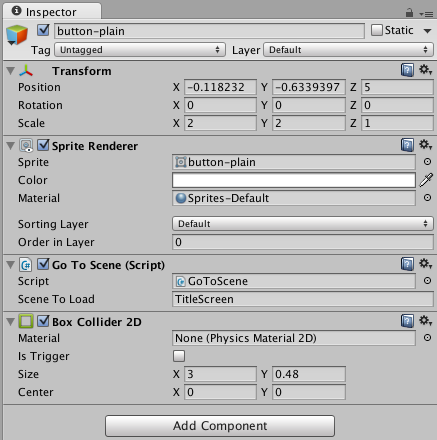

# Scene Change

This example shows how to change scenes in a Unity project.

# NOTES 

## Trigger *OnMouseDown* event

If you want to add a new object button, remember to add a Box Collider 2D on your objects in order to trigger *OnMouseDown*.

eg:

## Acknowledgements

